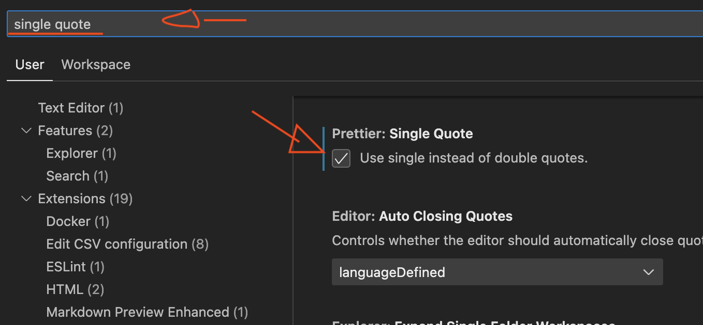

# Node.js - New Project Guide

Guide for setting up new Node.js projects

> No TypeScript.
> Use JavaScript ES6+ syntax (`let`, `const`, `async/await`, etc.).

## Version Management

- Use Node.js v20 or alternative LTS (long-term support) versions
- Install `nvm` to manage node.js version
- Run `nvm use 20` to switch to node.js version 20
- Add `.nvmrc` file to every project and include `20` to set node.js version
- Run `nvm use` to read version from `.nvmrc` file and switch to respective version

## Do once

- Install `prettier` globally for automatic code formatting on file save
- Turn on "Prettier: Single Quote" and "Prettier: Trailing Comma" in VS Code settings. Open the Command Palette (Command + Shift + P) and type "Preferences: Open Settings (JSON)". Select it. Add the following lines:

```json
{
  "prettier.singleQuote": true,
  "prettier.trailingComma": "es5"
}
```

Alternative to `settings.json` - visual settings:


## For every new project

### Auto-setup new project

- Create new folder for new project
- Copy `modules/setup-new-project.js` file to new project folder
- Run `node setup-new-project.js` to setup all files and project structure

### Manual setup

- Create new folder for new project
- Create a new git repo on GitHub. Run
  - `git init` to initialize repo locally.
  - `git remote add origin <repo-url>` to add remote repo.
  - Use Source Control tab in VS Code to add, commit and push files to GitHub repo.
- Init node.js project by `npm init -y` to create `package.json` file
- Install `npm i dotenv` locally to read variables from `.env` file

### Project Directory Structure

**Create:**

- `README.md`
- `modules` folder that includes all files for project
- `output` folder for saving any type of logging files during development, e.g. caching OpenAI responses, writing log files, etc.
- `modules/helpers.js` file that includes any type of generic helper functions, such as writing stuff to files (`toFile(...)`), de/compression, command-line confirm, etc
- `config/index.js` file that includes all the configuration variables for the project, such as API keys, URLs, etc.
- `.env` file to store all the environment variables, such as API keys, URLs, etc.
- `.gitignore` file to ignore `node_modules`, `.env`, `output` and other files/folders that should not be pushed to GitHub
- `.nvmrc` file to specify the node.js version for the project

**File naming convention:**

- `my-module.js`: use Kebab-case for file names, e.g. `my-module.js`, `my-module-name.js`, etc.
- `const myFunction = () => { ... }`: use camelCase for function names, e.g. `myFunction`, `myFunctionName`, etc.

**Structure:**

```
project-name
├── .gitignore
├── .nvmrc
├── .env              // add all sensitive environment variables here
├── README.md
├── config
│   └── index.js      // load .env variables and others to export them
├── modules           // includes app logic
│   ├── helpers.js
│   ├── module-name1.js
│   └── module-name2.js
├── output
│   ├── log.txt
│   └── cache.json
├── package.json      // auto-generated after `npm init -y`
├── package-lock.json // auto-generated after `npm install <package-name>`
├── node_modules      // auto-generated after `npm install <package-name>`
```

**File Structure:**

Start each file by importing required modules. Import modules in the following order:

1. `../config` or `require('dotenv').config()`
2. Native modules, eg `fs`, `path`, etc.
3. Third-party modules, eg `axios`, `express`, etc.
4. Local modules, eg `./helpers`, `./module-name1`, etc.

```js
const config = require('../config'); // config variables
const fs = require('fs'); // native module
const lodash = require('lodash'); // installed via `npm i axios`
const helpers = require('./helpers'); // local module
```

## Useful packages:

- lodash
- axios
- dotenv
- pm2

## Other Stuff

- When deciding what npm package to install, select the packages with higher download counts to ensure a larger community support
- Use UUIDs to create unique IDs
- Use Docker for databases and other services (eg PostgreSQL, ElasticSearch, Redis, etc.)
- Create `PROTOCOL.md` outlining steps on how to perform a repeatable process and clean up once done
- Use `.jsonl` files for large JSON files
- Sort JSON(L) files by `filedAt` or similar timestamp fields to make it easier to read
- Use `JSON.stringify(obj, null, 2)` to format JSON objects
- Use `pm2` to run scripts in the background.
  - Use `ecosystem.config.js` to configure `pm2` to define and run scripts.
  - `pm2 start ecosystem.config.js` to start the scripts
  - `pm2 logs` to view logs, `pm2 stop <id>` to stop the scrip, `pm2 restart <id>` to restart the script.

## VS Code

Setup VSCode to run files in terminal on `shift + enter`:

- Open the Command Palette (Command + Shift + P) and type "Preferences: Open Keyboard Shortcuts (JSON)". Select it.
- Add:

```json
{
  "key": "shift+enter",
  "command": "workbench.action.terminal.sendSequence",
  "args": {
    "text": "node ${file}\u000D"
  },
  "when": "resourceExtname == .js || resourceExtname == .mjs"
}
```

Format file on save:

- Open the Command Palette (Command + Shift + P) and type "Preferences: Open Settings (JSON)". Select it.
- Add:

```json
{
  "[javascript]": {
    "editor.defaultFormatter": "esbenp.prettier-vscode",
    "editor.formatOnSave": true,
    "editor.tabSize": 2 // Set the indent size to 2 spaces for JavaScript
  },
  "prettier.singleQuote": true,
  "prettier.trailingComma": "es5"
}
```

Turn Copilot on/off via `cmd + shift + t`:

- Open `keybindings.json` and add:

```json
{
  "key": "cmd+shift+t",
  "command": "settings.cycle.copilot",
  "when": "editorFocus"
}
```

- Open `settings.json` and add:

```json
"settings.cycle": [
    {
      "id": "copilot",
      "overrideWorkspaceSettings": true,
      "values": [
        {
          "github.copilot.enable": {
            "*": false,
            "markdown": false
          },
          "github.copilot.inlineSuggest.enable": false,
          "github.copilot.editor.enableAutoCompletions": false
        },
        {
          "github.copilot.enable": {
            "*": true,
            "markdown": true
          },
          "github.copilot.inlineSuggest.enable": true,
          "github.copilot.editor.enableAutoCompletions": true
        }
      ]
    }
],
```

## File Stuff

```js
const run = async () => {...}

if (require.main === module) {
    run();
}
```
